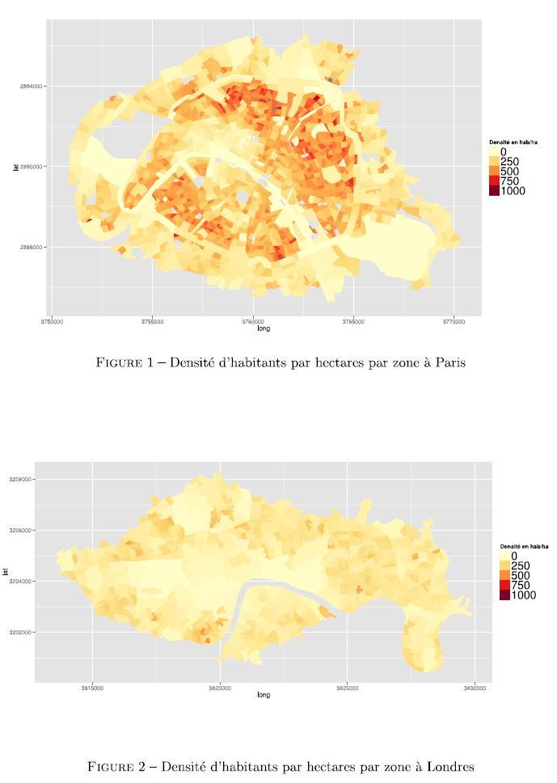

## Bike sharing demand factors investigation

### Context 
This project objective was to confront socio-economic and bicycle-sharing schemes data using statistical regressions in order to see what drives the demand for bikes in the two cities. The question beyond this was to know if it was possible to build a model to estimate the demand for bike-share in a new city in order to design new bike-share schemes. It appeared that, although some drivers for the demand were common to both London and Paris, the full picture of what creates the demand in a given city is as expected highly correlated to its socio-economic characteristic.
 

### Methodology 

We built a database of geographical attributes of each station using OpenStreetMaps, and other public datasets. We also used gaussian attribution to link landmarks to several stations continuously. 
We used Lasso regression to automatically pick the best parameters for the regression and compare the results between the two cities.

### Tools
- R : dplyr, ggplot, caret
- OpenStreetMaps
- Rstudio for development

### My involvment 
I was an intern in a lab, working directly for the professor in charge of the project and assisted by post-doc students. 

### Results and achievements

- Successfully applied advanced regression techniques to real world dataset to understand better how the demand is linked to geogrphical landmarks

