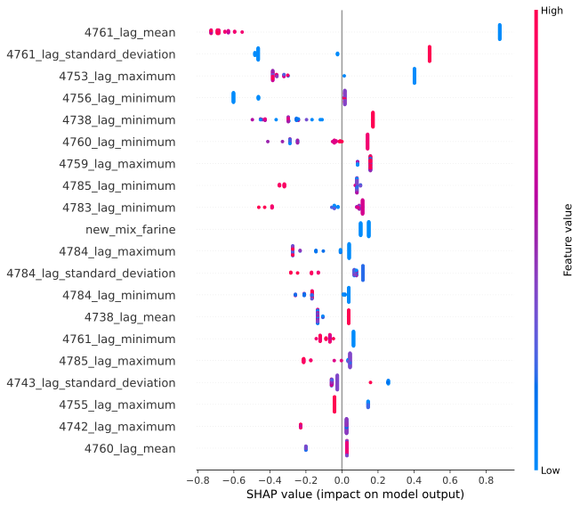

# Alerting module for PowerOP, a food production line monitooring SAAS 

## Context 
Dataswati develops [PowerOP](https://www.dataswati.com/en/powerop) a software as a service intended for the food processing industry. It centralises the data from the production line (sensors, settings, ingredients, recipes, etc. ) and leverages data visualisation and machine learning to help saving resources and improve quality. 

The alert module is used to notify the workers on the production line when something is going wrong or is going to go wrong in the near future. 

## Methodology 

There are different types of alerts : some are very basic and are just about making sure that a parameter stays inside a predefined interval (e.g. that the temperature stays below 200 °C ). Other types of alert are more sophisticated and rely on machine learning, like forecasting, classical time series analysis, supervised or unsupervised learning.

We built an AutoML pipeline that is configurable (eg: the input parameters are stored in a MongoDB Document). The user just has to define a binary classification problem, and other parameters such as the prediction horizon, the variables to include or to exclude in the model, the dates delimiting the training and validation sets, etc. Once all the parameters are set, a classification models will be trained (LightGBM, RandomForest or simple Logistic Regressions for baseline) on aggregation of the different time series and evaluated on the validation set. The best model is picked and used for alert prediction. The models are automatically retrained periodically and the new models are compared to the production model in terms of performance on the new test set. If the new model performs better it replaces the older one in production. A report is generated periodically to assess the real performance of the alert. A recommendation loop is ran using SHAP values perturbations to see how we could have avoided the alert and point to the problematic variables. There is a feedback loop as well from the user that can validate or invalidate an alert so that if he acts upon an alert and the problem does not occur it is not counted as a False Positive alert, rather as a True Positive that allowed to avoid the problem ! 

## Tools

- MongoDB as the main database 
- Python : pandas, LightGBM, scikit-learn, shap, optuna, mlflow 
- Airflow for scheduling and pipelining 
- Docker for packaging 
- VSCode for development

## My involvment 

I lead this project from start to finish including IHM design and product discussions with the management team and the customers, development of the code and the machine learning models, management of the development team

## Results and achievements

- first machine learning project that was put in production in real time at Dataswati
- lead to a customer actually conducting test on a production line to try and avoid a recuring problem that was well explained by the alert
- one of the main selling argument for PowerOP

