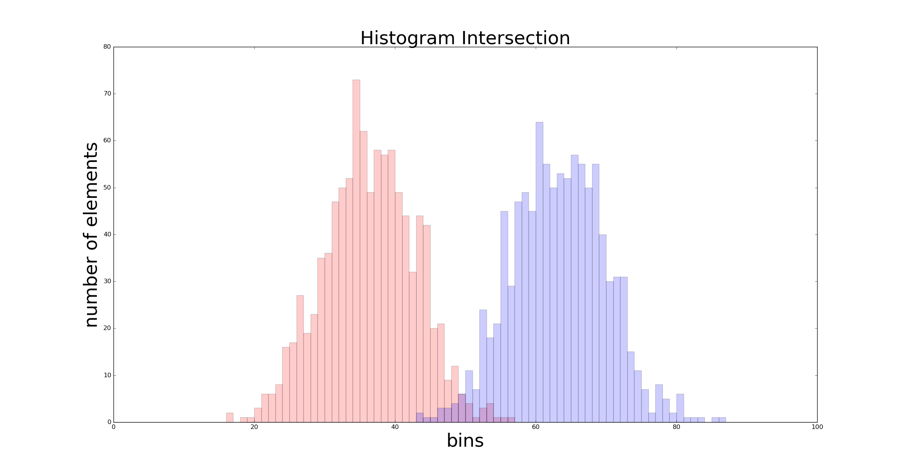
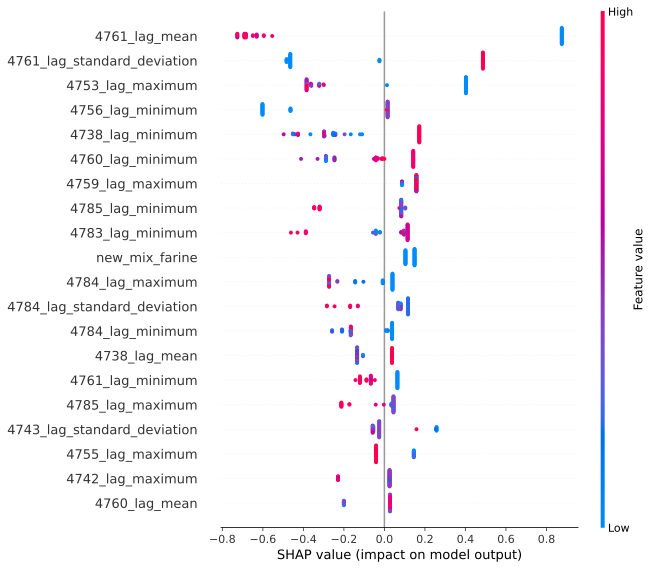

# Analysis module for [PowerOP](https://www.dataswati.com/en/powerop), a food production line monitooring SAAS 

## Context 
Dataswati develops [PowerOP](https://www.dataswati.com/en/powerop) a software as a service intended for the food processing industry. It centralises the data from the production line (sensors, settings, ingredients, recipes, etc. ) and leverages data visualisation and machine learning to help saving resources and improve quality. 

The analysis module is used to conduct an in depth analysis of the data underneath something (good or bad) happening on the production line. It is used to try an answer questions such as "Why do I have this quality problem ?" or "Why am I consuming too much energy ponctually ?" 

## Methodology 

There are two types of analyses, one is made from comparing data distributions, the other with a classification model explained with Shap values.

1. Distribution 
    The binary target variable is used to separate the dataset in two populations and we then measure the distances between the distributions of each variable on each population. The bigger the distance, the more correlated the variable is to the target. The distributions are then displayed on the platform and the user can zoom in on different time periods and select variables. We add an optimal value to separate the two distributions by training a simple decision tree of depth 1. 

   

2. Machine Learning
     We built an AutoML pipeline that is configurable (eg: the input parameters are stored in a MongoDB Document). The user just has to define a binary classification problem, and other parameters such as the variables to include or to exclude in the model, the dates delimiting the analysis, etc. Once all the parameters are set, a classification models is hyperoptimized (LightGBM or simple Logistic Regressions for baseline) on aggregations of the different time series and evaluated on the validation set. The best model is picked and Shap Values are used to extract the most contributive variables. All this information is displayed conveniently on the platform so that the user can zoom in on different time periods and select variables to understand in deep details the interactions between variables and the defined target. 

## Tools

- MongoDB as the main database 
- Python : pandas, LightGBM, scikit-learn, shap, optuna, mlflow 
- Airflow for scheduling and pipelining 
- Docker for packaging 
- VSCode for development

## My involvment 

I took this project and refactored it integrally to make it actually work and made multiple analyses and iterations to make the feature evolve with our customer. 

## Results and achievements

- revive a project and refactor if integrally to make it maintainable 
- lead to a customer actually conducting test on a production line to try and avoid a recuring problem that was well explained
- one of the main selling argument for PowerOP because it can be used without live data 

