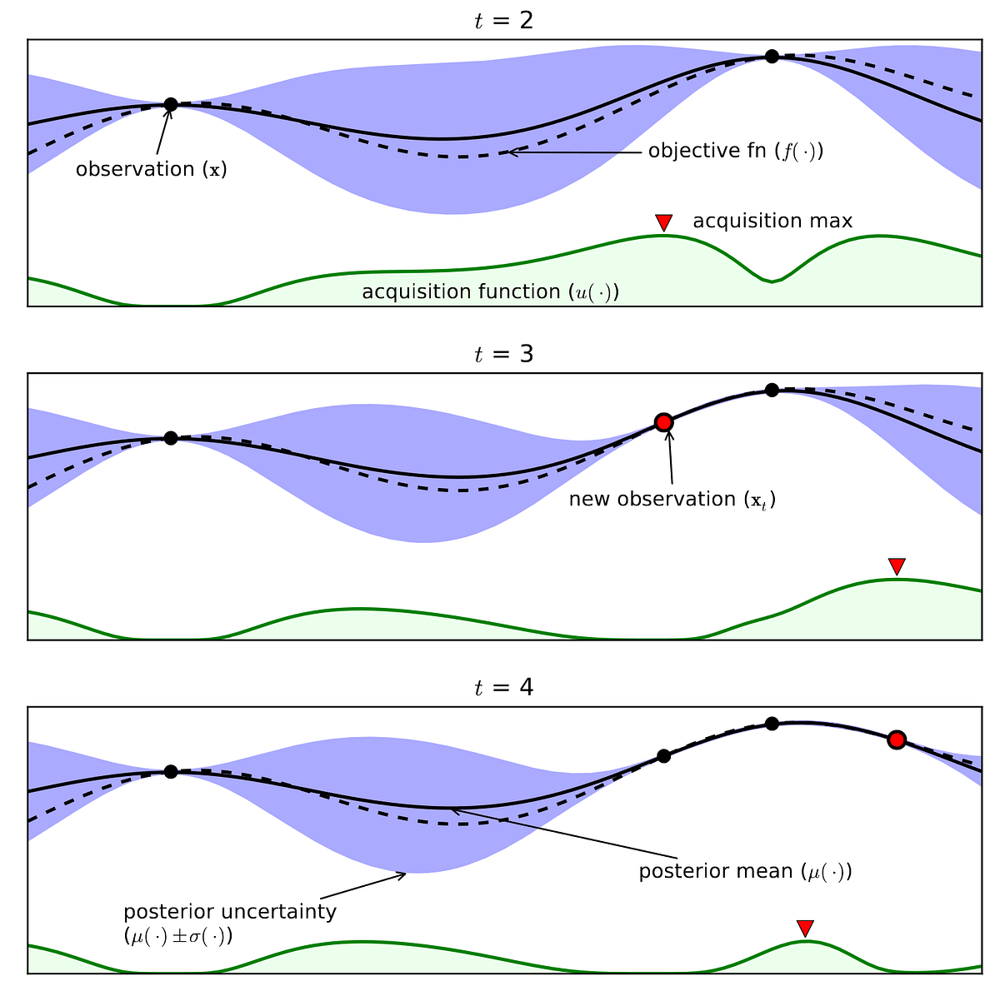

## Laboratory Experiment plan assistant for recipe building 

### Context 
Dataswati develops [PowerOP](https://www.dataswati.com/en/powerop), a Software-as-a-Service designed for the food processing industry. It collects data from various sources such as sensors, settings, ingredients, and recipes and uses advanced analytics to reduce resource consumption while improving product quality.

Built in partnership with a customer, this POC aimed to showcase the capacity to expedite and lower costs associated with a lab testing phase geared towards creating a novel product. Eventually, the goal is to integrate this feature into [PowerOP](https://www.dataswati.com/en/powerop), allowing users to explore different ingredients and processing methods while operating on current production lines.

If you wish to learn more about how PowerOP could benefit your organization, please visit the [official website](https://www.dataswati.com/en/powerop), you can ask for a demo on the website or or email the CEO directly at [averleyen@dataswati.com](averleyen@dataswati.com) to schedule a customized demonstration using the subject line "PowerOP Demo."

### Methodology 

When generating an experiment plan, laboratories traditionally adhere to a finite set of predetermined assays designed to examine various scenarios and evaluate their consequences. These evaluations are subjected to rigorous sorting procedures based on resource limitations, including factors such as available time, budgetary restraints, machinery requirements, and personnel availability. This approach is primarily reliant on expert insights, making exploration of the full parameter landscape impractical.

Our objective here was to revolutionize traditional experiment design workflow through the integration of advanced data analytics and Bayesian Optimization principles. By leveraging these technologies, we sought to refine the selection process, ultimately minimizing the number of required experiments while achieving equivalent results.

Critically defining the scope and parameters was fundamental to accomplishing our objectives. Our primary focus centered on determining the optimum parameter range, objective function, and constraints to achieve optimal efficiency during our iterative process utilizing the [Meta Ax platform] (https://ax.dev/docs/bayesopt.html).

Ax offers cutting-edge Bayesian Optimization techniques facilitating large-scale operations and continuous adaptation of the parameter space, objective functions, and constraints throughout the investigation cycle. By incorporating these features, we were able to introduce domain understanding, foster seamless collaboration between human analysts and the automated system, and enhance overall performance.

The implementation of this methodology resulted in significantly faster identification of the most effective established recipes when applied retrospectively across historical data. Following successful simulation validation, we transitioned to real-time operation alongside laboratory activities using an Excel interface synchronized with the optimization loop. Regrettably, however, the project had to be discontinued prematurely due to insufficient resources allocated and difficulties in accurately formulating the appropriate problem statement on the client side."

### Tools
- Microsoft Excel
- Python : ax, pandas, scikit-optimise 
- Docker for packaging 
- VSCode for development

### My involvment 

As part of my ongoing development work on this project, I assumed responsibility for further refining its functionality to better suit the needs of potential users while maintaining open communication channels with our clientele.

### Results and achievements

- successfuly apply state of the art bayesian optimisation algorithms to real world data
- demonstrate the feasibility of using it to optimize the experiment plans and access better results faster 

### References
[1] J. Snoek, H. Larochelle, R. P. Adams, Practical Bayesian Optimization of Machine Learning Algorithms. Advances in Neural Information Processing Systems 26, 2012.
[2] D. Eriksson, M. Jankowiak. High-Dimensional Bayesian Optimization with Sparse Axis-Aligned Subspaces. Proceedings of the Thirty-Seventh Conference on Uncertainty in Artificial Intelligence, 2021.
[3] S. Daulton, M. Balandat, E. Bakshy. Parallel Bayesian Optimization of Multiple Noisy Objectives with Expected Hypervolume Improvement. Arxiv, 2021.
[4] D. Eriksson, P. Chuang, S. Daulton, P. Xia, A. Shrivastava, A. Babu, S. Zhao, A. Aly, G. Venkatesh, M. Balandat. Latency-Aware Neural Architecture Search with Multi-Objective Bayesian Optimization. ICML AutoML Workshop, 2021.
