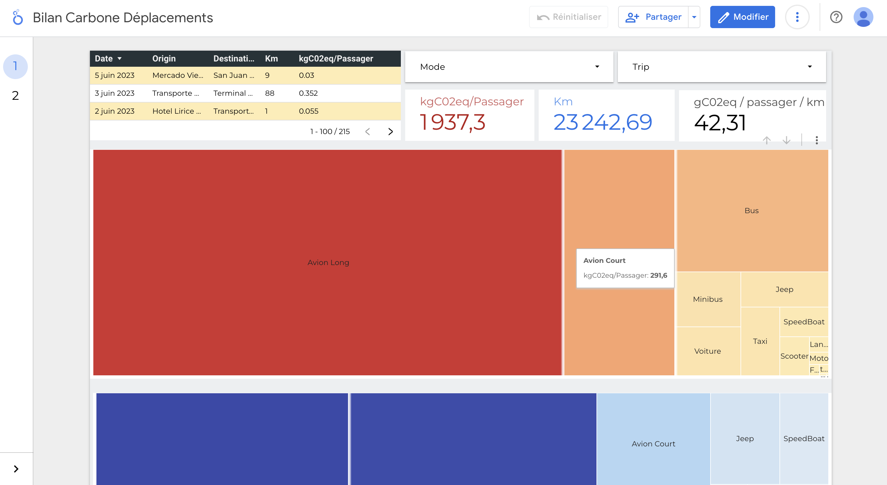

## Travel Carbon Footprint Dashboard 

### Context 
I traveled Central America for 7 months and wanted to monitor the C02 emissions of my journey. 

### Methodology 

I started consigning the trips to spreadsheet and added automation progressively. I used AppScript to make a Google Sheets function to call the google maps API to get the distance between two locations. I then used the distance to calculate the emissions using the emissions factor of the vehicle. I then used the emissions to calculate the carbon footprint of each trip. 
This spreadsheet is then used as the data source in a Looker Dashboard.  
I also wanted to be able to enter the data through a nice form from my phone so I deployed a ODK Central server on an AWS EC2 and set up the form that could be retrieved from the phone. There is then a small python code to insert the data into the spreadsheet that is scheduled with a crontab. 
Also use opensource code instead of Gmaps API for the geocoding and route distance calculation

### Tools
- Google Sheets
- Open Data Kit (ODK)
- Python : pandas, geopy, routingpy, pyODK
- AWS EC2, AWS Eventbridge
- VSCode for development

### My involvment 

This a personal experimentation project that I did on my own.

### Results and achievements

- Find an easy and convienient way to deploy forms to a phone without needing to develop an App
- demonstrate how much the plane emissions outweigh all the other means of transportation 

